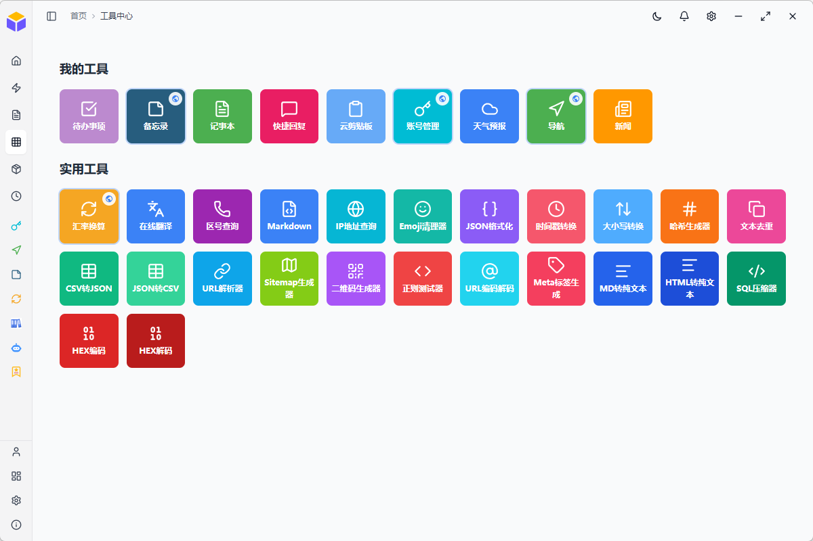
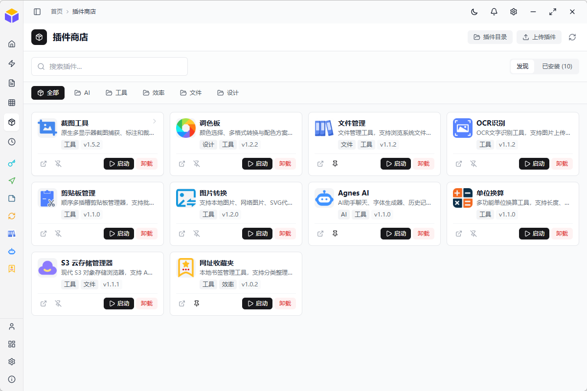

# ToolBox

[](./docs/CHANGELOG.md)
[](./LICENSE)

一个基于 Electron + React + TypeScript 构建的现代化桌面工具应用，集成多种实用工具和服务，支持插件扩展。

---

## 功能特性

- **快速启动**：智能搜索、应用分类管理、浮动窗口悬浮球
- **热点新闻**：聚合各大平台热点资讯，实时更新（头条、微博、抖音、知乎等）
- **网址导航**：便捷的网页导航服务，支持收藏管理
- **记事本**：本地文件系统笔记管理，支持文件夹和笔记操作
- **浮动窗口**：桌面悬浮球，快捷访问常用功能和系统命令
- **插件中心**：浏览、安装和管理第三方插件，持续扩展工具能力
- **工具箱**：33 款实用工具
  - 效率工具：待办事项、备忘录、快捷回复、云剪贴板、账号管理
  - 开发工具：JSON 格式化、URL 编码/解码、哈希生成、正则测试、SQL 压缩、HTML 转文本、HEX 编解码、CSV/JSON 互转、Markdown 处理
  - 转换工具：大小写转换、时间戳转换、进制转换
  - 实用工具：天气、翻译、汇率换算、OCR文字识别（插件版）、二维码生成、IP 信息查询、区号查询、Emoji 清理器
  - AI 工具：SEO 元标签生成、站点地图生成、调色板（AI 助手和字体生成器已迁移为插件）
  - 其他工具：文件管理、文本去重、URL 解析器
- **密码锁定**：支持通过 Ctrl+L 快捷键锁定/解锁应用，自动锁定功能
- **管理控制台**：数据可视化、用户管理、网址管理、工具管理、数据库备份（需管理员权限）
- **系统设置**：主题配置、存储管理、快捷键、日志监控、同步设置等
- **面包屑导航**：顶部导航栏显示当前位置路径，支持点击返回上级页面
- **最近使用**：自动记录最近访问的工具，最多保留 10 条记录
- **本地/云端双模式**：支持 SQLite 本地存储与 Supabase 云端存储切换，离线优先架构
- **S3 文件管理**：支持阿里云 OSS、腾讯云 COS、AWS S3 等对象存储服务
- **多平台支持**：桌面端、Web 端、移动端三端适配

---

## 应用截图





---

## 技术栈

| 分类   | 技术             | 版本     |
| ---- | -------------- | ------ |
| 框架   | React          | 19.x   |
| 语言   | TypeScript     | 6.x    |
| 构建工具 | Vite           | 5.x    |
| 桌面框架 | Electron       | 42.x   |
| 状态管理 | Zustand        | 5.x    |
| 数据获取 | TanStack Query | 5.x    |
| 样式   | TailwindCSS    | 3.x    |
| 图标   | Lucide React   | 1.x    |
| 拖拽   | @dnd-kit       | 6.x    |
| 数据库  | SQLite / Supabase  | - / -  |
| 编辑器  | Vditor         | 3.x    |

---

## 快速开始

### 环境要求

- Node.js >= 20.x
- pnpm >= 8.x（推荐）或 npm >= 9.x
- Git
- （可选）插件依赖（某些插件可能需要 Python）

### 安装依赖

```bash
pnpm install
```

### 开发模式

```bash
pnpm dev              # 启动 Vite 开发服务器
pnpm dev:electron     # 启动 Electron 模式开发服务器
pnpm electron:dev     # 启动 Electron 开发模式
```

### 构建生产版本

```bash
pnpm build            # 构建前端生产版本
pnpm electron:build   # 构建桌面应用安装包
```

---

## 可用命令

| 命令                    | 描述                  |
| --------------------- | ------------------- |
| `pnpm dev`            | 启动 Vite 开发服务器       |
| `pnpm dev:electron`   | 启动 Electron 模式开发服务器 |
| `pnpm build`          | 构建前端生产版本            |
| `pnpm preview`        | 预览构建结果              |
| `pnpm lint`           | ESLint 代码检查         |
| `pnpm electron:dev`   | 启动 Electron 开发模式    |
| `pnpm electron:build` | 构建 Electron 安装包     |
| `pnpm generate-icons` | 生成图标数据              |

---

## 项目结构

```
ToolBox/
├── electron/           # Electron 主进程
│   ├── window/         # 窗口管理（主窗口、浮动窗口、锁定窗口、托盘）
│   ├── services/       # 后端服务（笔记服务、插件服务）
│   ├── ipc/            # IPC 通信（文件管理、插件）
│   ├── lib/            # 工具库（配置、图标数据、快捷键管理）
│   ├── logs/           # 日志服务
│   ├── main.cjs        # 主入口文件
│   └── preload.cjs     # 预加载脚本
├── public/             # 静态资源（图标、图片、工具资源）
├── src/                # 前端源码
│   ├── components/     # 通用组件（布局、表单、UI、图标）
│   ├── pages/          # 页面组件（桌面、移动端、Web、工具页、管理后台）
│   ├── services/       # 服务层（API、数据访问、缓存）
│   ├── store/          # 状态管理（Auth、Theme、Toast 等）
│   ├── hooks/          # 自定义 Hooks
│   ├── types/          # TypeScript 类型定义
│   ├── utils/          # 工具函数
│   ├── config/         # 配置文件（路由、常量）
│   └── styles/         # 全局样式
├── scripts/            # 脚本工具
├── plugins-store/      # 插件仓库
├── docs/               # 文档目录
└── readme.md           # 项目说明
```

---

## 文档

| 文档 | 说明 |
| --- | --- |
| [更新日志](docs/CHANGELOG.md) | 版本更新记录 |
| [贡献指南](docs/CONTRIBUTING.md) | 代码贡献规范 |
| [配置说明](docs/CONFIGURATION.md) | 环境配置指南 |
| [设计规则](docs/DESIGN_RULES.md) | 功能拓展开发规范 |

---

## 许可证

MIT License
